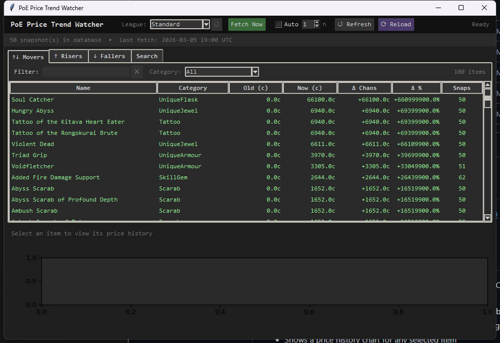

# MetaNinja

A Path of Exile price trend watcher that pulls data from [poe.ninja](https://poe.ninja) and tracks price movements over time.



## What it does

- Fetches prices for all major item categories from poe.ninja (Currency, Uniques, Gems, Divination Cards, Scarabs, Essences, and more)
- Stores every fetch as a snapshot in a local SQLite database, building a price history over time
- Surfaces the items moving the most — risers, fallers, and biggest movers — in a sortable, filterable table
- Shows a price history chart for any selected item
- Supports any league via a dropdown that loads live from the GGG API

## Screenshots

| Movers tab | Price history chart |
|---|---|
| *(add your own)* | *(add your own)* |

## Requirements

- Python 3.10+
- matplotlib

```
pip install -r requirements.txt
```

## Usage

```bash
python trend_watcher.py
python trend_watcher.py --league "Settlers"
```

### Controls

| Control | Description |
|---|---|
| **League dropdown** | Select the league to fetch prices for; click ↺ to reload the league list |
| **Fetch Now** | Pull a fresh snapshot from poe.ninja and store it |
| **Auto** + interval | Automatically fetch every N hours |
| **↺ Refresh** | Reload the tables from the local database without fetching |
| **⟳ Reload** | Restart the app (picks up any code changes) |

### Tabs

| Tab | Description |
|---|---|
| **↑↓ Movers** | Items with the largest absolute % change between oldest and newest snapshot |
| **↑ Risers** | Items with the largest positive % change |
| **↓ Fallers** | Items with the largest negative % change |
| **Search** | Search for any item by name and view its price history |

Each tab has a **name filter** (live, as you type) and a **category dropdown** so you can narrow down to e.g. only Currency or only Scarabs.

Clicking any row shows the item's full price history as a chart at the bottom of the window.

## Files

| File | Purpose |
|---|---|
| `trend_watcher.py` | Main GUI application |
| `price_db.py` | SQLite storage layer (`price_history.db`) |
| `fetch_ninja_prices.py` | poe.ninja API fetcher |
| `seed_fake_history.py` | Dev tool — inserts 24h of fake hourly data for testing |

## Data storage

All price data is stored in `price_history.db` (SQLite) in the same directory. The database is created automatically on first run. Each fetch appends one row per item, so the database grows over time and trends become visible after two or more snapshots.

The database is excluded from version control via `.gitignore` — your price history stays local.

## Seeding test data

If you want to see the trend charts without waiting for real data to accumulate, run:

```bash
python seed_fake_history.py
```

This inserts 24 fake hourly snapshots for every item currently in the database, with a random ±1–100 chaos drift per item.

## License

MIT
